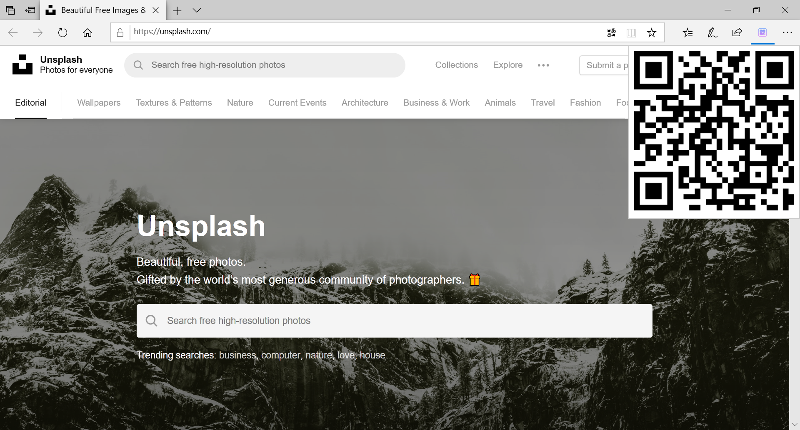
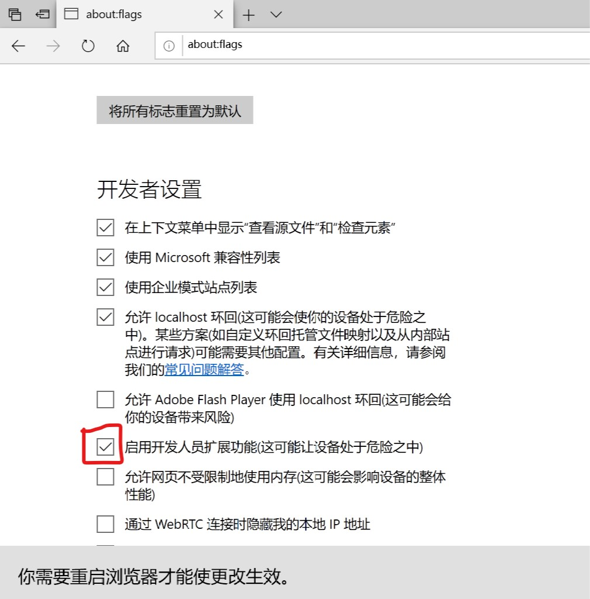
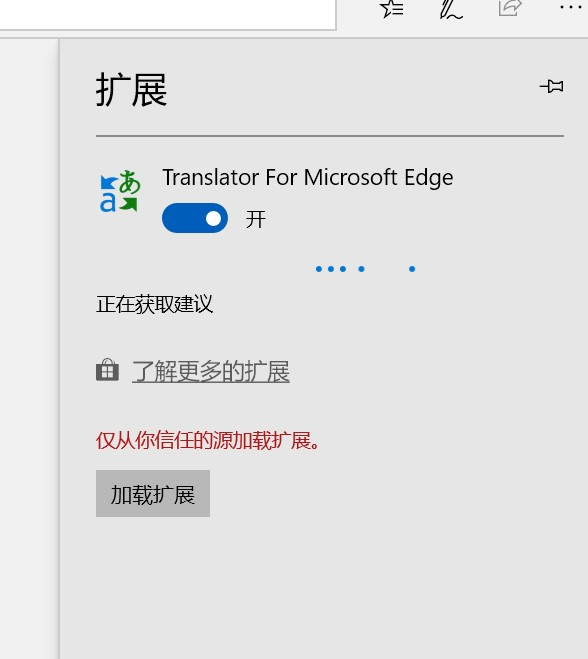

## 二维码生成插件 for Edge

### [Edge(Chromium)版在这里](https://github.com/Vove7/QrCode-for-Edge-Chromium-)

### 预览

### 安装方法:

1. clone 此项目

2. 在Edge地址栏输入`about:flags`,开启开发模式

</img>

3. 重启Edge后,选择加载扩展,选择项目目录即可

</img>

### Thanks

- [jQuery](https://jquery.com/)

- [jquery-qrcode](https://github.com/jeromeetienne/jquery-qrcode)